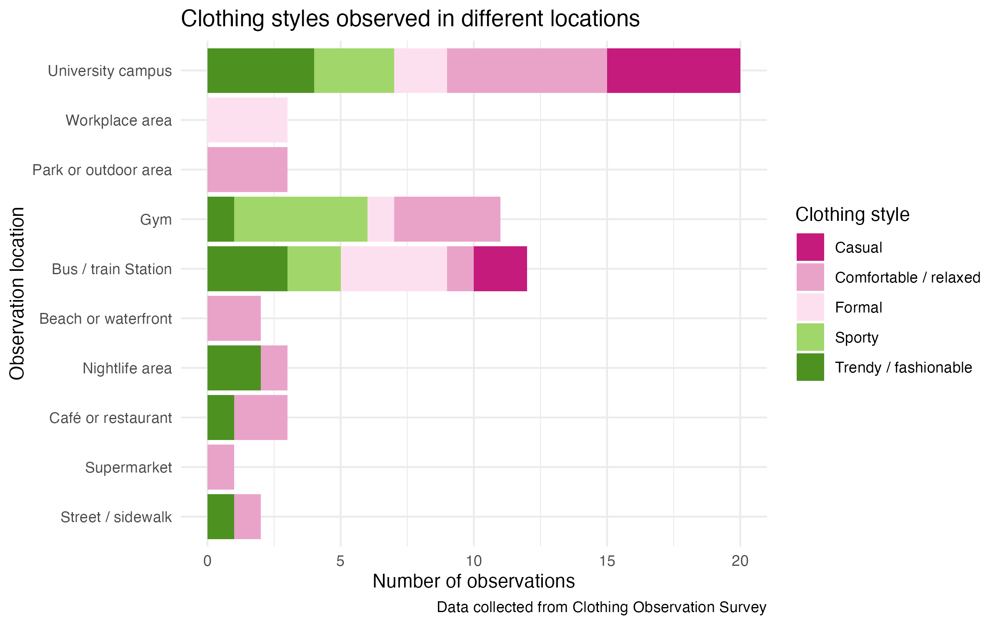
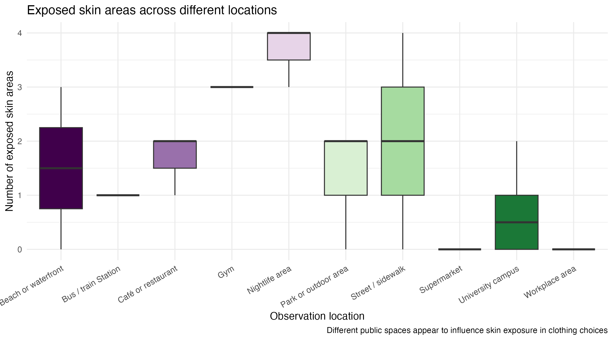
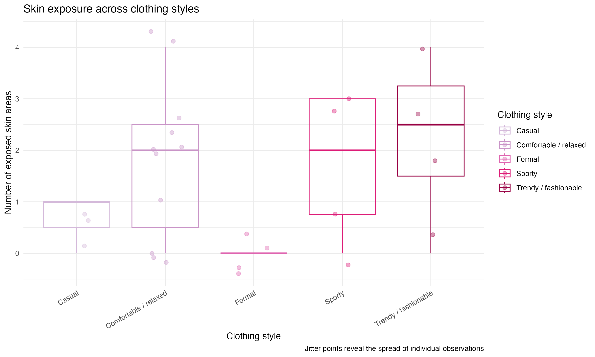
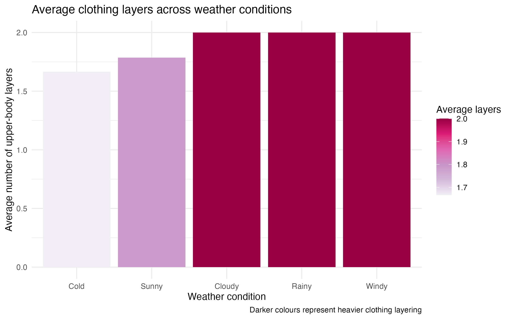
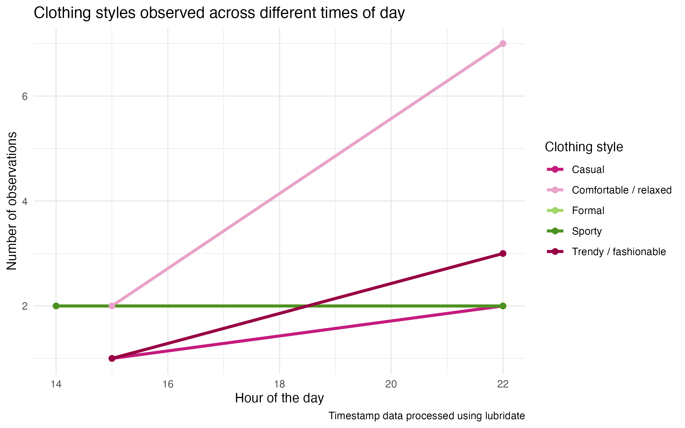
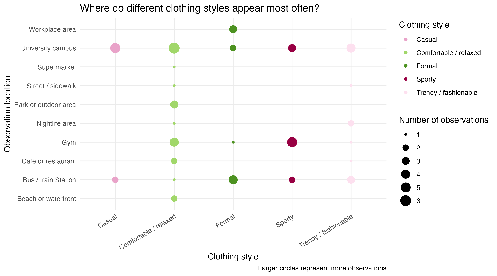
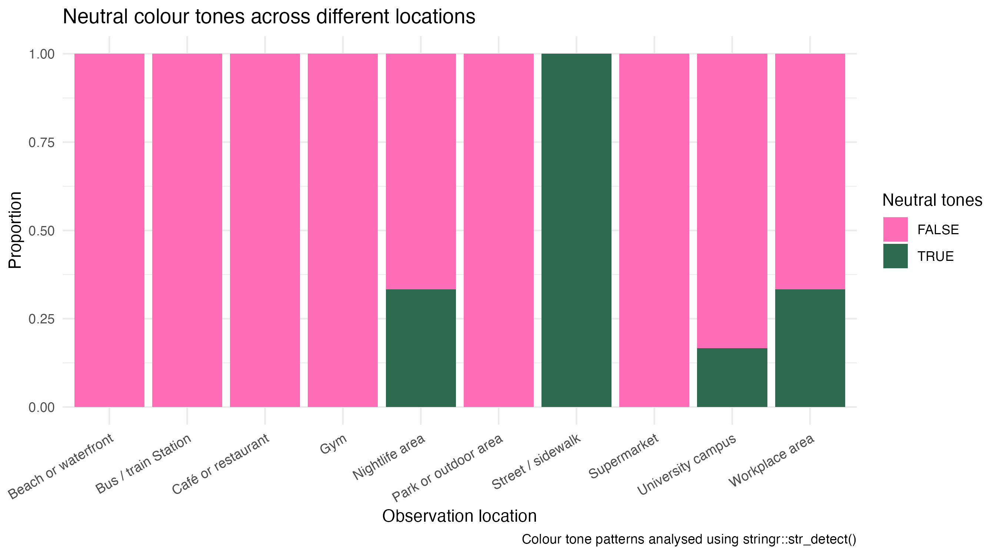

<script src="https://code.jquery.com/jquery-3.7.1.min.js" integrity="sha256-/JqT3SQfawRcv/BIHPThkBvs0OEvtFFmqPF/lYI/Cxo=" crossorigin="anonymous"></script>

```{r setup, include=FALSE}
knitr::opts_chunk$set(echo=FALSE, message=FALSE, warning=FALSE, error=FALSE)
```

```{js}
$(function() {
  $(".level2").css('visibility', 'hidden');
  $(".level2").first().css('visibility', 'visible');
  $(".container-fluid").height($(".container-fluid").height() + 300);
  $(window).on('scroll', function() {
    $('h2').each(function() {
      var h2Top = $(this).offset().top - $(window).scrollTop();
      var windowHeight = $(window).height();
      if (h2Top >= 0 && h2Top <= windowHeight / 2) {
        $(this).parent('div').css('visibility', 'visible');
      } else if (h2Top > windowHeight / 2) {
        $(this).parent('div').css('visibility', 'hidden');
      }
    });
  });
})
```

```{css, echo=FALSE}
.figcaption {display: none}

body {
  background-color: #0f0f0f;
  color: #f5f5f5;
  font-family: Georgia, serif;
  line-height: 1.8;
}

.author {
  text-align: center;
  color: white;
  font-size: 20px;
  margin-bottom: 30px;
  border: 2px solid #ff4fa3;
  display: inline-block;
  padding: 10px 25px;
  border-radius: 12px;
  display: table;
  margin-left: auto;
  margin-right: auto;
}

h1 {
  color: #ff4fa3;
  text-align: center;
  font-size: 44px;
  letter-spacing: 2px;
}

h2 {
  color: #ff89c7;
  border-bottom: 2px solid #ff4fa3;
  padding-bottom: 8px;
  margin-top: 50px;
}

p {
  font-size: 18px;
  color: #f2f2f2;
}

strong {
  color: #ff4fa3;
}

img {
  display: block;
  margin-left: auto;
  margin-right: auto;
  max-width: 90%;
  border-radius: 14px;
  border: 2px solid #ff4fa3;
  box-shadow: 0px 0px 18px rgba(255, 79, 163, 0.45);
}

.figure {
  text-align: center;
}

.figcaption {
  text-align: center;
  color: #d9d9d9;
  font-size: 15px;
  margin-top: 10px;
}

a {
  color: #ff89c7;
}

a:hover {
  color: #ffffff;
}

.caption {
  text-align: center;
  color: #cfcfcf;
  font-size: 15px;
}

code {
  background-color: #1e1e1e;
  color: #ff89c7;
}

pre {
  background-color: #1a1a1a;
  border-left: 3px solid #ff4fa3;
  padding: 10px;
}
```

## Clothing styles in different public spaces



This visualisation compares clothing styles across different public spaces. University campuses showed the widest mix of clothing styles, including casual, sporty, and trendy outfits. This suggests that some environments allow greater flexibility in self-presentation and fashion choices.

## Skin exposure in different locations



This plot explores how exposed skin areas change depending on location. Places connected to movement, nightlife, or social activity appear to have higher levels of skin exposure, while more formal or practical environments appear more covered.

## Clothing styles and skin exposure



Different clothing styles appear to influence how much skin is visible. Sporty and fashionable styles tend to show more exposed skin areas, while formal clothing appears more conservative and covered.

## Weather and clothing layers



This visualisation shows how weather conditions may influence layering choices. Rainy, cloudy, and windy conditions generally resulted in higher average clothing layers compared with sunnier weather.

## Clothing styles across time



This plot uses timestamp data to explore how clothing styles shift across different times of day. More relaxed or comfortable clothing styles appear more frequently later in the day.

## Clothing styles across locations



This bubble chart explores where different clothing styles were observed most frequently across public locations. Larger circles represent higher numbers of observations. Comfortable or relaxed clothing styles appeared more often on university campuses, while sporty styles were more common in gym environments.

## Neutral colour tones across locations



This plot explores how neutral colour tones appear across different public locations. The data was manipulated using `stringr::str_detect()` to identify outfits that included neutral colour tones. Neutral colours appeared more frequently in workplace and university settings, while more colourful outfits appeared more often in outdoor and casual public spaces.